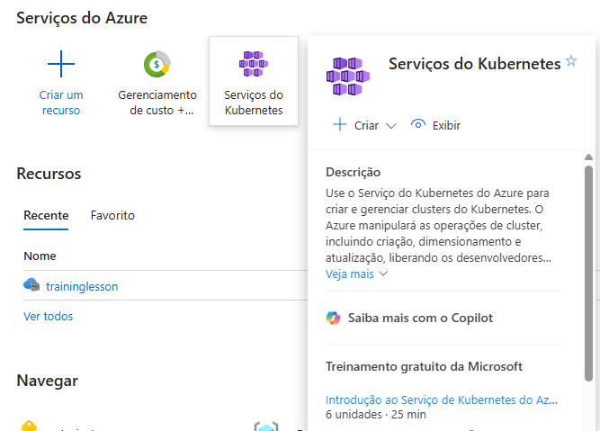
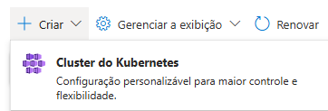
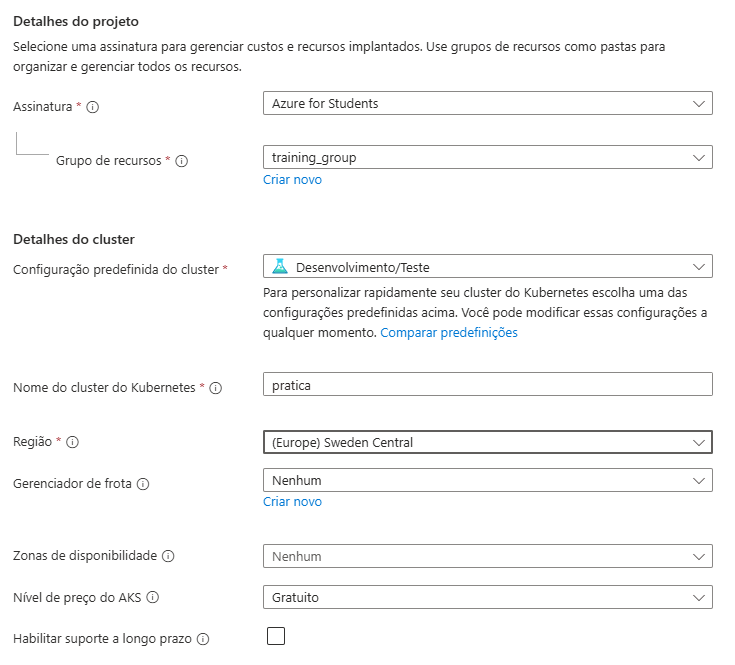
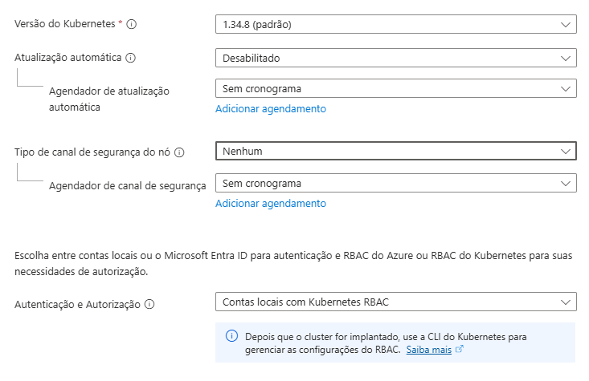
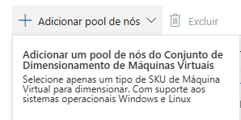
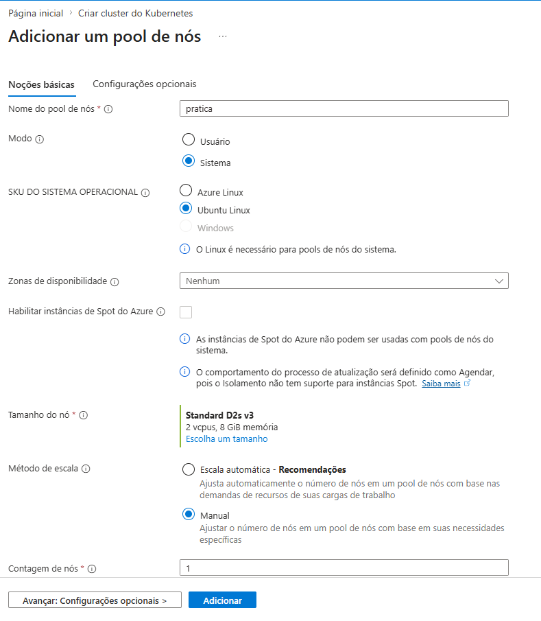

# Requisitos

## Alternativa 1
- Conta estudante na Azure com crédito (https://techcommunity.microsoft.com/discussions/azure/how-college-students-can-claim-free-azure-credits-and-start-building-in-the-clou/4471767)
- Azure CLI (https://learn.microsoft.com/en-us/cli/azure/install-azure-cli?view=azure-cli-latest)
- Kubectl (https://kubernetes.io/docs/tasks/tools/)

### Passo 1
Acesse e faça login na Azure: https://azure.microsoft.com/en-us/free/students

### Passo 2
Acesse o serviço Kubernetes:

### Passo 3

### Passo 4
- Dê o nome do grupo de recursos como `training_group`
- Nome do cluster: `pratica`
- Região: `North Central US`

- Próximo

### Passo 5
- Adicionar pool de nós -> Primeira opção

- Nome do pool: pratica
- Modo: Sistema
- SO: Ubuntu linux
- Zonas de disponibilidade: nenhuma marcada
- Método de escala: Manual(1 nó)
- Tamanho do nó: Série D v3 -> D2s_v3

- Selecione o pool criado(pratica) -> próximo
- Na aba de rede: Atribuir apenas algum nome aleatório para o DNS, apenas `próximo`

### Passo 6
- Revisar + Criar -> Aceitar tudo 

### Passo 7
- Abra o CMD e digite `az login` -> Selecione e faça login na sua conta utilizada para criação do Cluster(não o email da FAG, o seu próprio e-mail usado para criação da conta Azure)
- Digite 1(para escolher sua conta estudante) e confirme
- Rode o comando `az aks get-credentials --resource-group training_group --name pratica`

### Passo 7
Verificar se o cluster Kubernetes está funcionando corretamente:

`kubectl get pod -A` -> lista os pods do cluster(vários defaults que controlam o cluster)

`kubectl get nodes -o wide` -> lista os nodes com atributos a mais

### Passo 8
- Criar um namespace: `kubectl create namespace teste`
- No terminal, naveguem até o diretório contendo o projeto clonado
- Executem `kubectl apply -f manifest.yaml` -> Isso irá aplicar os objetos que descrevemos no arquivo manifest.yaml e subir um service e um deployment com a nossa aplicação, sendo que, o service irá expor um IP público para acessar a aplicação.
- Executar `kubectl get svc -n teste` -> Irá exibir um EXTERNAL_IP no service criado(conversor-temperatura), copiem e colem no navegador este IP, irá abrir a aplicação
- Para ver os logs da aplicação, executar `kubectl get pod -n teste`, copiar o NAME do pod e então `kubectl logs -f -n teste NAME_DO_POD`

### Passo 9(OPCIONAL)
Se quiser verificar a escalabilidade horizontal(adição de mais um pod para suportar a carga de requisições).

- Vá no arquivo load-test.ps1 e substitua o "0.0.0.0" da variável $TARGET_IP pelo IP da sua aplicação
- Rode em um novo terminal dentro da pasta do repositório clonado: `./load-test.ps1`(se não estiver no Windows, utilize o load-test.js executando `node load-test.js` com node instalado), aguarde uns 2 minutos e então execute `Ctrl+C` para interromper a execução
- Execute no terminal utilizado para o kubectl `kubectl get pod -n teste` e veja o aumento da quantidade de pods para 2, isso se deve devido à alta volumetria de requisições para a aplicação, onde o Kubernetes automaticamente identificou e criou mais um pod para suportar a volumetria

### Passo 10
Acesse a home na Azure, serviço Kubernetes, selecione o cluster criado -> Parar -> Excluir

---

## Alternativa 2
- Docker Desktop (https://www.docker.com/products/docker-desktop/)
- kind (https://kind.sigs.k8s.io/docs/user/quick-start/#installation)
- Kubectl (https://kubernetes.io/docs/tasks/tools/)

### Passo 1
Instale e inicie o **Docker Desktop**.

### Passo 2
Instale o **kind**:
- Windows (PowerShell): `winget install Kubernetes.kind`
- Ou baixe o binário diretamente em https://kind.sigs.k8s.io/docs/user/quick-start/#installation

### Passo 3
Crie o cluster usando o arquivo de configuração incluso no projeto:

`kind create cluster --name pratica --config kind-config.yaml`

O `kind-config.yaml` mapeia a porta `80` do seu computador para dentro do cluster, de forma que a aplicação fique acessível em `http://localhost`.

Verifique se o cluster está funcionando:

`kubectl get nodes`

### Passo 4
- Crie o namespace: `kubectl create namespace teste`
- No terminal, navegue até o diretório do projeto clonado
- Execute `kubectl apply -f manifest-kind.yaml` — isso cria o Deployment, o HPA e um Service do tipo **NodePort** expondo a aplicação na porta `80`
- Execute `kubectl get pod -n teste` e aguarde o pod ficar com status `Running`
- Acesse **http://localhost** no navegador para abrir a aplicação

### Passo 5
Para ver os logs da aplicação:
- `kubectl get pod -n teste` → copie o NAME do pod
- `kubectl logs -f -n teste NAME_DO_POD`

### Passo 6 — Instalar metrics-server (necessário para o HPA funcionar)
O kind não inclui o metrics-server por padrão. Execute os dois comandos abaixo para instalá-lo e habilitá-lo no ambiente local:

`kubectl apply -f https://github.com/kubernetes-sigs/metrics-server/releases/latest/download/components.yaml`

`kubectl patch deployment metrics-server -n kube-system --type='json' -p='[{"op":"add","path":"/spec/template/spec/containers/0/args/-","value":"--kubelet-insecure-tls"}]'`

Aguarde aproximadamente 1 minuto até o metrics-server inicializar antes de seguir para o teste de carga.

### Passo 7 (OPCIONAL) — Teste de carga
Se quiser verificar a escalabilidade horizontal:

- Vá no arquivo `load-test.ps1` e substitua o `"0.0.0.0"` da variável `$TARGET_IP` por `"localhost"`
- Rode em um novo terminal dentro da pasta do repositório clonado: `./load-test.ps1`, aguarde uns 2 minutos e então execute `Ctrl+C` para interromper
- Execute no terminal do kubectl `kubectl get pod -n teste` e veja o aumento da quantidade de pods para 2

> **Não está no Windows?** Use `node load-test.js` como alternativa — antes, substitua `'0.0.0.0'` por `'localhost'` na variável `TARGET_IP` do arquivo.

### Passo 8 — Limpeza
`kind delete cluster --name pratica`
